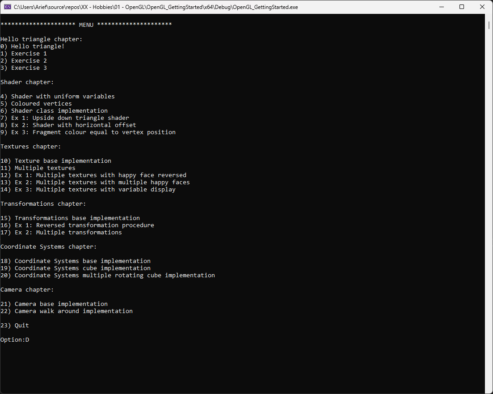
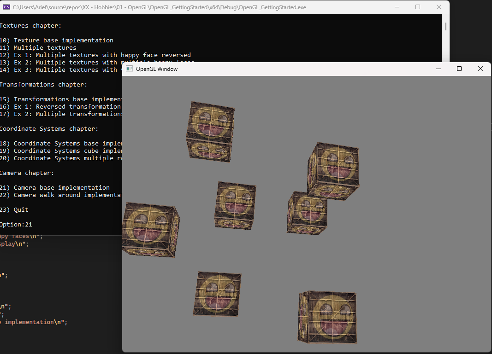

# OpenGL-Fundamentals
This repository is based on the Getting started chapter of the OpenGL tutorial from Joey de Vries on [LearnOpenGL](https://learnopengl.com/) webiste.
The purpose of this repository is to documents the progress and knowldedge of OpenGL.

## Getting Started
To install the application, head to [Creating a Window](https://learnopengl.com/Getting-started/Creating-a-window) page
on [LearnOpenGL](https://learnopengl.com/) website. In this page, a guide is provided to install the necessary libraries and set
configurations for this project.

In brief, the requirements are:
- GLFW
- CMake
- GLAD

## Menu Application
At startup, the program will prompt the user to choose the different implementations from the GettingStarted chapter.
Once an implementation is selected, a new window will appear and showcase the work.

